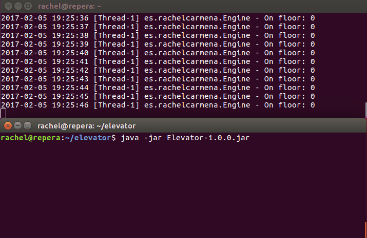

# Elevator

Description [here](https://github.com/Pragmatists/elevator-kata).

My implementation consists of:
* Main thread _presses_ the buttons.
* Elevator has its own thread.

In this way, buttons can be pressed while elevator is going up or going down.

NOTES for thinking in the future:
* You have a building with three elevators.
* Several button panels (possible concurrent requests):
    * Inside elevator
    * On each floor
